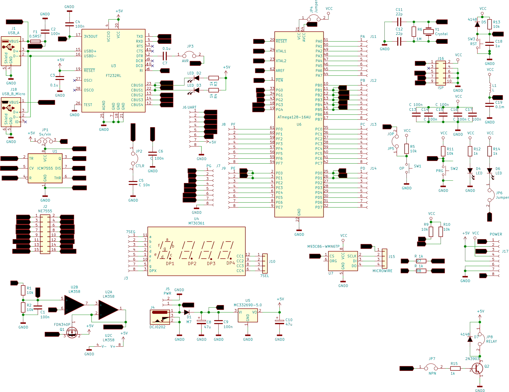
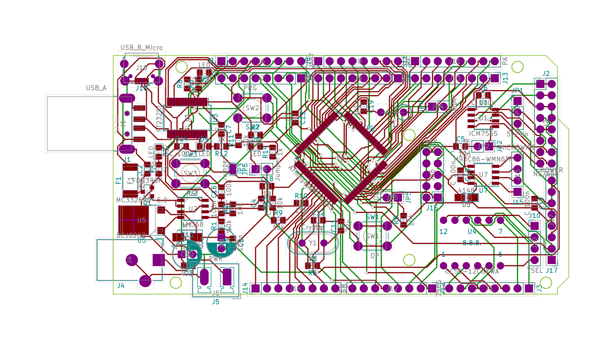

# Irk-stud-duino (Arduino like) board to arrange studying Real-time systems.

Printed circuit design for Arduino-like board, allowing students to study microcontrollers with less soldering.

*ATTENTION! This PCB Design is not complete, e.g., it is not pin-compatible with Arduino Mega.**

##TODO:

- Move big components on the top of PCB (swap sides).
- Move silk text to a visible place.
- Use SMD Capacitors around 5V rectifier.

PCB made with/by KiCAD and FreeRouting.

## Current scheme

## Current PCB layout

License - MIT.

Regards,
Evgeny Cherkashin, Ph.D.
Irkutsk
