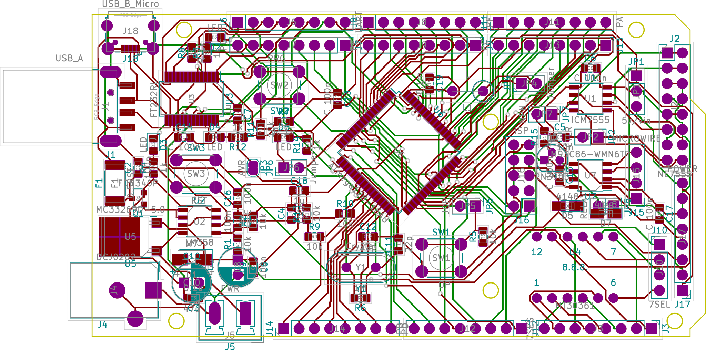

# Irk-stud-duino (Arduino like) board to arrange studying Real-time systems and Differential equations.

Once I bough sale components in an internet shop.  Now I thought why not use them to in studying Real-time systems and Differential equations.

The components are:

- ICM7555 FET timer module,
- MT30361 Common cathode 7-segment 3-digit LED module,
- M93C86 Microwire EEPROM,
- B57164-K 223-J, 22 кОм, 5%, NTC thermistor (not user now in the PCB),
- 2N3904 N-P-N transistor (not used).

Most of the components wrapped with their pin headers and jumpers.

Printed circuit design for Arduino-like board, allowing students to study microcontrollers with less soldering.

__ATTENTION! This PCB Design is not complete, e.g., it is not pin-compatible with Arduino Mega.__

##TODO:

- Move big components on the top of PCB (swap sides).
- Add an N-P-N transistor in key mode with some components to connect output of 7555, *e.g.*, with a relay.
- Move silk text to a visible place.
- Use SMD Capacitors around 5V rectifier.
- Write a handbook.

PCB made with/by KiCAD and FreeRouting.

## Current scheme

## Current PCB layout

License - MIT.

Regards,
Evgeny Cherkashin, Ph.D.
Irkutsk
